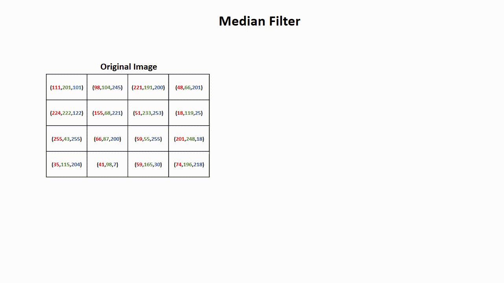

# Image-Denoiser
## Salt and Pepper Noise removal using Median filter written in C++ using free GLUT (an OpenGL Utility Library)

### Median Filter:
Median filtering is a nonlinear process useful in reducing impulsive, or salt-and-pepper noise. The median filter is also used to preserve edge properties while reducing the noise. Also, the smoothing techniques, like Gaussian blur is also used to reduce noise but it can’t preserve the edge properties. The median filter is widely used in digital image processing just because it preserves edge properties.

This project also contain the User Interface written in opengl.

### Median Filtering Illustration:
(This .gif image is made by me using power point,If any one want that ppt,then contact me)

### UI:
